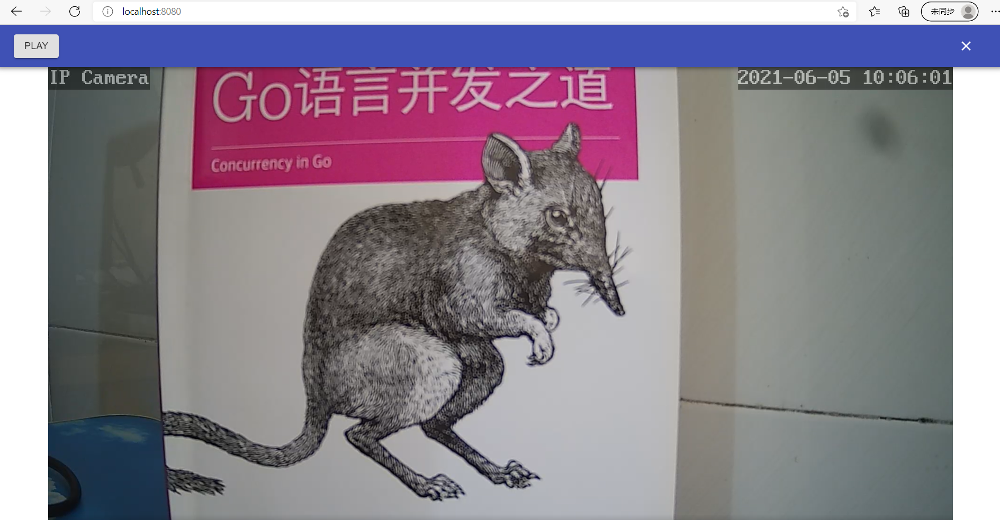

#### rtsp2rtmp



##### 项目说明：

1. 用户配置摄像头信息，包括（摄像头编号：code、摄像头rtsp地址：rtspURL、推送的rtmp地址：rtmpURL等）
2. 系统连接到摄像头，获取音视频数据
3. 系统解析摄像头数据，保存为flv文件
4. 系统推送搭到配置好的rtmp服务器
5. 用户请求观看视频，系统返回视频数据给用户播放

##### 解析说明：

1. 音视频编解码使用的是[开源项目](https://github.com/deepch/vdk.git)的功能
2. 服务器连接到摄像头，服务器获取到音视频数据，解析为av.packet，分发给FileFlvManager和HttpFlvManager处理
3. FileFlvManager将数据封装为flv文件的数据格式，写入文件
4. RtmpFlvManager将数据封装为rtmp流的数据格式，发送到rtmp服务器
5. 用户通过http方式和服务器连接请求视频数据，HttpFlvManager将av.packet封装为httpflv格式数据返回

##### 配置说明：

```
server:
    httpflv:
        port: 8080 #程序的http端口
    fileflv:
        save: true #是否保存录像文件
        path: ./output/live #录像文件夹
    log:
        path: ./output/log #日志文件夹
        
```

##### 开发说明：

程序分为服务器和页面，服务端采用golang开发，前端采用react+materia-ui，完成后编译页面文件放入服务器的static文件夹

###### 服务器开发说明：

1. 安装golang，gc++编译器(sqlite3模块的需要用到，window下可选择安装MinGW)
2. 获取[服务器源码](https://github.com/hkmadao/rtsp2rtmp.git)
3. 进入项目目录
4. go build开发

###### 页面开发说明：

1. 安装node
2. 下载[页面源码](https://github.com/hkmadao/rtsp2rtmp-web.git)
3. 进入项目目录
4. npm install
5. npm run start