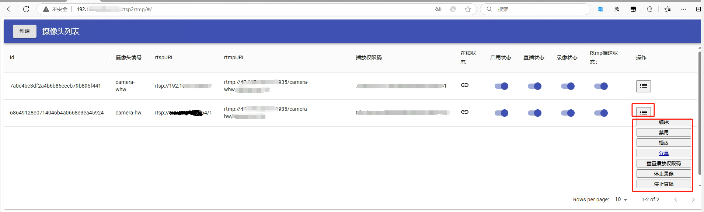

# rtsp2rtmp


## 关于rtsp2rtmp
rtsp2rtmp项目实现了连接rtsp协议的设备（摄像头等），采集视频流转换成flv录像文件，httpflv流，rtmp流，可作为监控或者直播项目。

## 安装说明
> 注意：
>
>   建议下载带"_sqlite3"的版本，无需安装数据库即可快速开始运行了解功能，其他版本需要根据配置文件和初始化sql文件创建数据库，连接数据库开始才能运行。
>   sqlite3版本使用到了cgo功能，编译比较麻烦，建议在ubuntu中安装mingw-w64进行交叉编译，可参照sqlite3分支下的build.sh查看交叉编译信息
>
>   程序目前支持h264视频编码、aac音频编码，若不能正常播放，关掉摄像头推送的音频再尝试

1. 软件下载地址：https://github.com/hkmadao/rtsp2rtmp/releases   
2. 解压，找到'./resources/conf/conf-prod.yml'配置文件，修改相关配置
3. 根据下载版本，运行 rtsp2rtmp 程序
4. 打开：http://[ip:localhost]:[port:8080]/rtsp2rtmp ,如：http://127.0.0.1:8080/rtsp2rtmp , 默认用户名/密码: admin/admin

## 使用说明：
1. 打开摄像头列表页面
    
2. 点击创建按钮，跳转到创建摄像头页面，填写信息，完成摄像头创建
    *若摄像头的音频格式是G711或者其它，目前是不支持的，需要在摄像头配置中禁用音频*
    
3. 查看摄像头列表页面，等待摄像头程序连接摄像头（大约30秒左右）
    
4. 找到摄像头功能列表
    
    4.1. 启用/禁用
        管理是否获取rtsp的视频数据流，禁用后，将不再拉取rtsp的视频数据流
    4.2. 播放   
        播放摄像头视频，若是摄像头没有音频，请停止音频，然后再点播放按钮进行播放
        
    4.3. 重置播放码
        摄像头播放的httpflv是通过url的编号和权限码控制的，建议定时更换播放权限码
    4.4. 开启/停止录像
        可根据需求确定是否开启或停止录像，停止后，将不再生成flv录像文件
    4.5. 开启/停止直播
        开启或停止HttpFlv发布播放视频流，停止后，通过客户端或者web将不能播放摄像头视频
    4.6. 开启/停止Rtmp推送
        开启或停止向Rtmp服务器推送视频流
    4.7. 分享   
        **发现摄像头正在拍摄有趣的事情，赶紧分享给好友吧**
        摄像头的视频流可以通过HttpFlv进行发布，网页或客户端可以拉取视频流进行播放，但是是需要通过url的信息做编码和密码的匹配的，在分享功能页面可以创建分享的url信息，并且控制是否分享、分享时长等   
        4.3.1. 分享列表
            可在分享列表页面查看、管理分享信息
            
        4.3.2. 创建分享
            填写分享信息，保存
            

## 项目说明：

1. 用户配置摄像头信息，包括（摄像头编号：code、摄像头rtsp地址：rtspURL、推送的rtmp地址：rtmpURL等）
2. 系统连接到摄像头，获取音视频数据
3. 系统解析摄像头数据，保存为flv文件
4. 系统推送搭到配置好的rtmp服务器
5. 用户请求观看视频，系统返回视频数据给用户播放

## 解析说明：

1. 音视频编解码使用的是开源项目[vdk](https://github.com/deepch/vdk.git)的功能
2. 服务器连接到摄像头, 服务器获取到音视频数据, 解析为 av.packet, 分发给 FileFlvAdmin, RtmpFlvAdmin, HttpFlvAdmin 处理
3. FileFlvAdmin 将数据封装为flv文件的数据格式, 写入文件
4. RtmpFlvAdmin 将数据封装为rtmp流的数据格式, 发送到rtmp服务器
5. HttpFlvAdmin 将数据封装为httpflv流数据格式, 等待http请求连接, 返回流数据供web端或者其他客户端播放视频   

> 注意：
>
>   若想快速运行，可下载带_sqlite3结尾的版本，该版本使用的是sqlite3数据库，无需安装数据库即可运行
>   sqlite3版本使用到了cgo功能，编译比较麻烦，建议在ubuntu中安装mingw-w64进行交叉编译，可参照sqlite3分支下的build.sh查看交叉编译信息
>
> ​	程序目前支持h264视频编码、aac音频编码，若不能正常播放，关掉摄像头推送的音频再尝试

## 目录结构：

```
--rtsp2rtmp #linux执行文件
--rtsp2rtmp.exe #window执行文件
  --resources
    --static #程序的网页文件夹
    --conf #配置文件文件夹
      --conf-dev.yml #配置文件
      --conf-prod.yml #配置文件
    --output #程序输出文件夹
      --live #保存摄像头录像的文件夹，录像格式为flv
      --log #程序输出的日志文件夹
```

## 配置说明：

```
server:
    user:
        name: admin #网页登录用户名
        password: admin #网页登录密码，不要用纯数字，有bug
    httpflv:
        port: 8080
        static:
            path: ./resources/static #页面所在文件夹
    fileflv:
        path: ./resources/output/live #录像所在文件夹
    log:
        path: ./resources/output/log #日志所在文件夹  
        level: 6 #1-7 7输出的信息最多 
    database:
        driver-type: 4 #数据库类型
        driver: postgres #数据库驱动
        url: user=postgres password=123456 dbname=rtsp2rtmp host=localhost port=5432 sslmode=disable TimeZone=UTC #数据库url
        show-sql: false     #是否打印sql
```

## 开发说明：

程序分为服务器和页面，服务端采用golang开发，前端采用react+materia-ui，完成后编译页面文件放入服务器的resources/static文件夹,或者修改配置文件页面所在文件夹的路径

### 服务器开发说明：

1. 安装golang
2. 获取[服务器源码](https://github.com/hkmadao/rtsp2rtmp.git)
3. 安装postgresql数据库，根据配置文件"resources/conf/conf-prod.yml"创建数据库
4. 根据"docs/init/rtsp2rtmp-postgresql.sql"文件创建表    
5. 进入项目目录
6. go build开发

### 页面开发说明：

1. 安装node
2. 下载[页面源码](https://github.com/hkmadao/rtsp2rtmp-web.git)
3. 进入项目目录
4. npm install
5. npm run start
